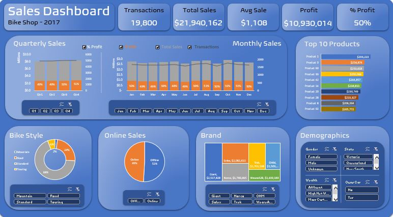

# Bike Shop Transactions Dashboard in Excel

## Project Overview
The purpose of this workbook is to explore and analyze bike shop sales data, then summarize it in a visually compelling and interactive dashboard.  

## Installation and setup
Download and open the file Bike_Shop_Dashboard.xlsx and open it in Excel.

### Source Data
The [dataset] (https://www.kaggle.com/datasets/rohitsahoo/bicycle-store-dataset) is called "bicycle store dataset" and was acquired from Kaggle.com.

### Data Acquisition
I downloaded the data directly from Kaggle.

### Data Preprocessing
The data originally came in 4 .csv files.  I combined them as different tabs in an Excel .xlsx file. I then used XLOOKUP() to combine all of the data needed for the dashboard into a tab called “Working Sheet”. On that sheet, I converted the data into a table, then extracted the “Transaction Month”, “Month Name”, and “Quarter Columns” for use as slicers. The Online column was in True/False format. I wanted them to say “Online” and “Offline” in the dashboard so I created the “Online/Offline” column with IFS() to convert it.  Finally, I calculated the “Profit” as a function of “List Price” – “Standard Cost”

The main challenges were dealing with incomplete data and formatting the transaction dates.  The Customer Address file has no customer ID; fortunately, the Customer Demographic file does and has all of the information I needed.  I found there are about 127 transactions with no corresponding customer data.  I deleted those rows from the Working Sheet to create a cleaner dashboard but did not remove them from the source tabs or the original data.  

The one major formatting issue was the transaction date.  It is in day, month, and year order.  Excel converted any dates starting with 1-12 to Excel serial but mistook the month for the day and vice-versa. They were displayed as dd/mm/yyyy format. I used =DATE(YEAR(D6),DAY(D6),(MONTH(D6)) to reverse them. The remaining dates were shown as d-m-yyyy. I used the formula =DATE(RIGHT(D8,4),MID(D8,4,2),LEFT(D8,2))) to extract those dates. 
 
## How to Use the Project
The main tab is called "Dashboard".  All of the slicers and checkboxes affect all tables.  Both multi-select and single-select options are available.  

To view the underlying data for the dashboard, select the "Pivot Table" tab. The charts are all driven by the pivot tables on that tab, and all pivot tables are sourced from Table1 in the Working Sheet tab.  The transaction table on that tab was copied from the transactions tab, and the rest of the columns are pulled from the other data source tabs using VLOOKUP(). 

## Results and evaluation
Ultimately, I was able to create the kind of analysis and dashboard I wanted, but I have questions about the data.  It is almost too uniform an a lot of ways.  The sales are very steady from month to month, almost perfectly split between online and offline sales, and nearly uniformly divided between bike brands.  While it's possible it is legitimate, I am left wondering if it might have been artificially created.  Unfortunately, the user who posted the dataset hasn't responded to the comments that have been posted asking for more information.

## Visuals

## Future work
 
## Credits
- Thanks to Rohit Sahoo.  I used the dataset from his [Kaggle](https://www.kaggle.com/datasets/rohitsahoo/bicycle-store-dataset) dataset. 
- I took inspiration and learned a few new skills from this  [YouTube video](https://www.youtube.com/watch?v=bjLIA1vSqGs) by Lean Excel Solutions

## License
[GNU General Public License, version 2](https://www.gnu.org/licenses/old-licenses/gpl-2.0.en.html)

