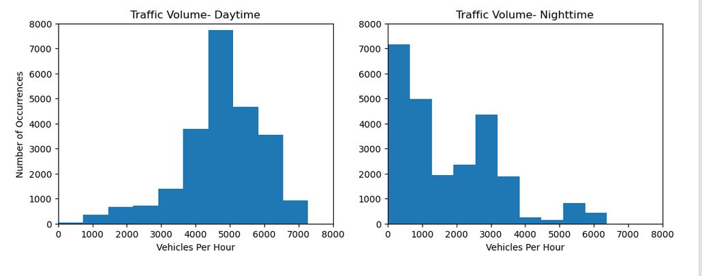
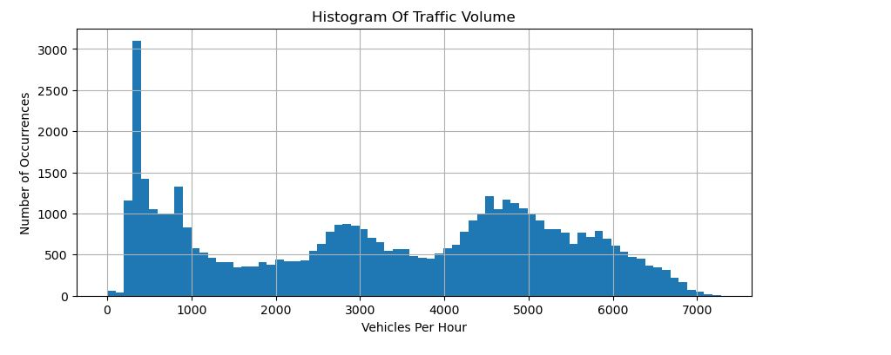
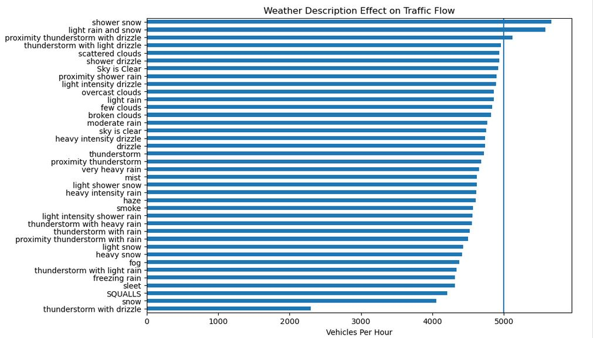

# Finding Heavy Traffic Indicators on I-94

## Overview

The aim of this notebook is to determine heavy traffic indicators on Interstate 94 between Minneapolis and St. Paul, Minnesota and explain the findings using data visualization. I examined the effects of time of year, time of day, day of week, and weather on heavy traffic, then visualized my findings with Seaborn. 
  
## Installation and Setup
This project can be run directly from gituhub or downloaded and run in JuPyter notebook.

### Codes and Resources Used

- Editor Used: Jupyter notebook 6.5.2
- Python Version: Python 3.10.9

### Python Packages Used

- General Purpose:
    - Datetime
- Data Manipulation: 
    - NumPy and Pandas
- Data Visualization: 
    - Matplotlib
    - Seaborn

## Data

### Source Data

- Primary Dataset: [Metro Interstate Traffic Volume](https://archive.ics.uci.edu/ml/datasets/Metro+Interstate+Traffic+Volume) from the UCI Machine Learning Repository, as made available by John Hogue. The data covers the time period from October 2012 to September 2018, as recorded at a station approximately halfway between Minneapolis and Saint Paul. 

### Data Acquisition

The dataset was already downloaded and proviced in .csv format by dataquest as Metro_Interstate_Traffic_Volume.csv.  I imported it using Pandas.read_csv()

### Data Preprocessing

The data was relatively clean. I did convert the `date_time` column to datetime format using the datetime library.  I also used the same to create year, month, day, and day of week columns for easier processing.  Additionally, I found some obvious bad values in the `temp` and `rain_1h`. I converted them to NaN.
  
## Code structure

    ├── Finding Heavy Traffic Indicators on I-94.ipynb
    ├── Metro_Interstate_Traffic_Volume.csv
    └── Visuals
        ├── histogram_day_vs_night.jpg
        ├── histogram_traffic_flow.jpg
        └── weather_description_traffic_flow.jpg
        
        
  
## Results and evaluation
I discovered multiple time and weather-related indicators of heavy traffic on I-94.  Traffic tends to be heavier in warmer months ((March–October) compared to cold months (November–February)).  Traffic is heavier during the day, particularly weekdays, with rush hours centering around hours 7 (7 AM) and 16 (4 PM)

### Visuals

  

  

  
## Future work
I would like to do more reasearch into the drop in traffic in July in 2016,2017, and 2018, as well as the overall dip in 2016. 

  
## Acknowledgments/References

Guided Project: Dataquest
Dataset: John Hogue from the UCI Machine Learning Repository
  
## License
Source code is licensed under the [GPL 3.0 License](https://www.gnu.org/licenses/gpl-3.0.en.html).

Contents of this site are © Copyright 2023 Patrick T. Smith. All rights reserved.