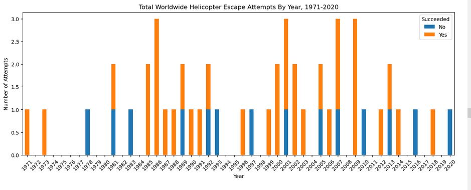
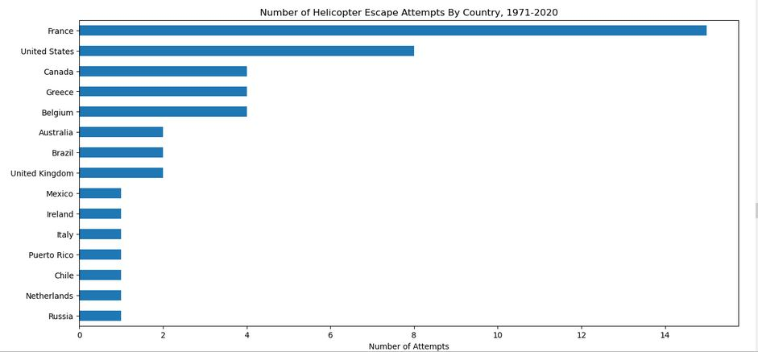
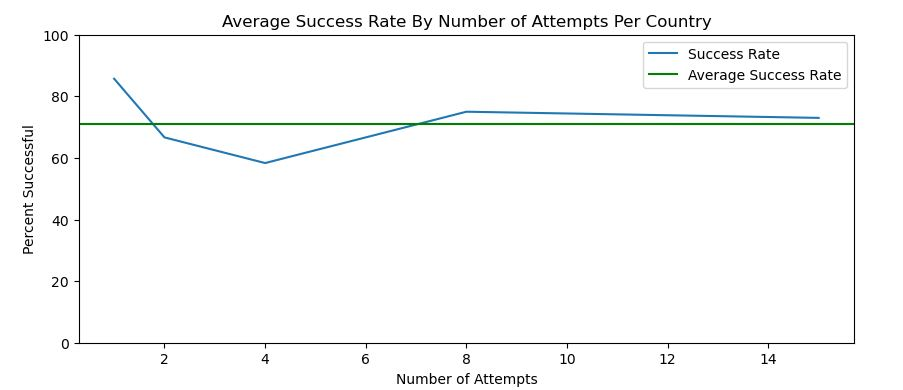

# Guided Project - Helicopter Prison Escapes

This is a Guided Project for the Data Analyst Certificate on dataquest.io. The object is to gather and analyze data on prison escapes from around the world where a Helicopter was used. I downloaded the data from Wikipedia and analyzed it in Jupyter notebook using the Python Pandas library.  I examined the number of attempts per year between 1971 and 2020, the number of escapes per country and the success rate in each country. 
  
## How to Install and Run the Project
Click on the .ipynb file to open and view the project in Github.  If you would like to run it yourself, download the following files and run them in Jupyter Notebook. 
- Helicopter Prison Escapes.ipynb
  
## Installation and Setup

### Codes and Resources Used

- Editor Used: Jupyter notebook 6.5.2
- Python Version: Python 3.10.9

### Python Packages Used

- General Purpose: N/A
- Data Manipulation: NumPy, Pandas
- Data Visualization: Matplotlib
  
## Data

### Source Data
Data was pulled from the Wikipedia Page ["Helicopter Prison Escapes"](https://en.wikipedia.org/wiki/List_of_helicopter_prison_escapes)
### Data Acquisition

Data was retrived directly from the Wikipedia page using Pandas.read_csv() and then extracted from the table within. 
### Data Preprocessing

Minimal preprocessing was required.  I removed the details column since it contained a lot of text I did not use. I also extracted the year from the date column uding string slicing and created a separate column for it. 
  
## Code structure

    ├── Helicopter Prison Escapes.ipynb
    ├── Readme.md
    └── Visuals
        ├── attempts_by_country.jpg
        ├── attempts_per_year.jpg
        └── success_rate_by_number_of_attempts.jpg

 

## Results and evaluation

I found that in the years 1971-2020, there have been 48 escape attempts, or approximately one per year. More than half the years saw at least one attempt.  Most years (20) there was one. Eight years saw two attempts. The most attempts in any one year was three, happening four times, in 1986, 2001, 2007, and 2009. 

15 Countries are represented in the dataset France had the most attempts with 15, followed by the United States with 8.  A few countries had 4 attempts, three others had 2, and the remaining 7 had only one attempt.  Overall the success rate is about 71%.  The countries with at least 4 attempts had a success rate of 50-75%, while the countries with 1 or 2 averaged between about 60 and 90%. Though it does appear that an attempt in a country with zero attempts would have the most chance of succeeding and those with 2 or 3 would have a lower chance, it's difficult to draw conclusions with such a small dataset. 

 

## Visuals

The below are some of the visuals generated in this analysis:

  

  

## Future work

In the future, I might like to look to answer addition questions such as:
- How does the number of escapees affect the success?
- Which escapees have done it more than once?
- How many escapees were ultimately returned to prison?

The way that the escapees are listed in the table with no clear separator and some of the information being located in the text of the details column will make this a bit more challenging and may require some manual counting or further manipulation. 

 

## Acknowledgments/References

- Guided project: [Dataquest](https://app.dataquest.io/c/115/m/610/guided-project%3A-prison-break/1/jupyter-notebook)
- Dataset: [Wikipedia](https://en.wikipedia.org/wiki/List_of_helicopter_prison_escapes)

## License

Source code is licensed under the [GPL 3.0 License](https://www.gnu.org/licenses/gpl-3.0.en.html).

Contents of this site are © Copyright 2023 Patrick T. Smith. All rights reserved.
